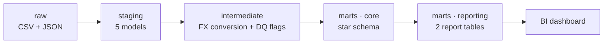

# eCommerce Analytics Engineering Challenge

An end-to-end analytics engineering pipeline that turns raw operational eCommerce data (CSV + JSON) into a clean, tested dbt warehouse on DuckDB, answering two business questions through a BI-ready reporting layer.

**Business questions answered:**
1. Which products are the top performers in sales volume and revenue?
2. What is the optimal time of day to run sales promotions, based on historical transaction patterns?

Full design rationale, assumptions and trade-offs are documented in **[`design_notes.md`](./design_notes.md)** — this README covers what the project is and how to run it.

## Architecture



Three layers, each with a single responsibility:

| Layer | Schema | What it does |
|---|---|---|
| **Staging** | `staging` | Cast types, rename columns, normalize values — one model per source, no joins |
| **Intermediate** | `intermediate` | Reusable business logic: currency conversion to USD, data-quality flags |
| **Marts – core** | `marts` | Star schema: 3 fact tables (`fct_orders`, `fct_order_items`, `fct_fx_rates`) + 5 dimensions |
| **Marts – reporting** | `marts` | 2 wide, aggregated tables — one per business question — feeding the dashboard |

See [`design_notes.md`](./design_notes.md) for the full reasoning on grain, keys, currency normalization and data-quality handling, and [`docs/star_schema_erd.png`](./docs/star_schema_erd.png) / [`docs/lineage_dag.png`](./docs/lineage_dag.png) for the diagrams.

## Repository structure

```
.
├── analytics_engineer_assets/     # Raw source files (CSV + JSON, as provided)
├── ingest/
│   ├── 01_ingesta_raw.ipynb       # Loads raw files into warehouse.duckdb (schema: raw)
│   └── 02_exploracion_raw.ipynb   # Data profiling / quality exploration (read-only)
├── ecommerce_dbt/                 # dbt project
│   ├── models/
│   │   ├── staging/               # 1:1 cleaned sources + _sources.yml
│   │   ├── intermediate/          # FX conversion + enrichment
│   │   └── marts/
│   │       ├── core/              # Star schema: facts + dimensions
│   │       └── reporting/         # rpt_product_performance, rpt_sales_by_hour
│   ├── macros/                    # generate_schema_name, custom generic tests
│   ├── tests/                     # Singular (business-rule) tests
│   ├── dbt_project.yml
│   └── profiles.yml               # Points to ../warehouse.duckdb (no credentials needed)
├── exports/
│   ├── export_reports.py          # Exports the 2 report tables to CSV/Parquet
│   └── output/                    # Exported files consumed by the dashboard
├── docs/
│   ├── lineage_dag.png            # dbt docs lineage graph
│   ├── star_schema_erd.png        # Star schema entity-relationship diagram
│   └── star_schema_erd.mmd        # Mermaid source for the ERD
├── design_notes.md                # Architecture, assumptions, data quality, trade-offs
├── warehouse.duckdb                # Persisted DuckDB warehouse (raw → staging → marts)
└── README.md
```

## How to run

**Requirements:** Python 3.10+, `dbt-duckdb`, DuckDB.

```bash
pip install dbt-duckdb
```

1. **Ingest raw data** — loads the 5 source files into `warehouse.duckdb` (schema `raw`):
   ```bash
   jupyter nbconvert --to notebook --execute ingest/01_ingesta_raw.ipynb
   ```
   (or run it interactively in VS Code / Jupyter)

2. **Build and test the warehouse** — runs staging → intermediate → marts and all tests:
   ```bash
   cd ecommerce_dbt
   dbt build
   ```
   Expected result: `0 errors`, a handful of `warnings` — each one a documented, known data-quality issue (see `design_notes.md`, section 4).

3. **Generate documentation / lineage graph** (optional):
   ```bash
   dbt docs generate
   dbt docs serve
   ```

4. **Export the reporting tables** for the BI layer:
   ```bash
   cd ..
   python exports/export_reports.py --format both
   ```

5. **Open the dashboard** — see [Dashboard](#dashboard) below.

## Data model

A star schema with **two fact tables at different grains**, since the two business questions need different granularities:

- **`fct_order_items`** (grain: order line) — the only table where `product_id` exists; answers Q1.
- **`fct_orders`** (grain: order, includes orders with no lines) — answers Q2; deriving it from lines would silently drop 93 orders (20%) that have no line items.
- **`fct_fx_rates`** (grain: currency + rate date) — supports FX-evolution analysis and traceability.

Dimensions include explicit "unknown" members for source-data gaps (unknown products, invalid currencies), so every fact-to-dimension relationship passes referential-integrity tests with `severity: error`.

📄 Full rationale: [`design_notes.md`](./design_notes.md#2-transformation-with-dbt) · 🖼️ Diagram: [`docs/star_schema_erd.png`](./docs/star_schema_erd.png)

## Data quality

Raw data was profiled before modelling (`ingest/02_exploracion_raw.ipynb`), surfacing issues such as invalid currency codes, order lines referencing products outside the catalogue, and orders without line items. The guiding principle: **detect, flag, handle explicitly — never silently drop a row.**

Every issue is enforced by a dbt test and quantified in `rpt_data_quality` / `design_notes.md` (section 4), including its impact on each business question.

## Testing

`dbt build` runs **generic tests** (`unique`, `not_null`, `relationships`, `accepted_values`, a custom `positive_value` test) plus **singular tests** enforcing business rules — e.g. that enriched models preserve row counts, that the two fact tables reconcile with each other, and that reporting totals match the underlying facts.

## Dashboard

_Add a link or screenshot(s) here once the BI layer is built (e.g. Evidence, a Python/Jupyter notebook, Power BI, Metabase)._

## Tech stack

| | |
|---|---|
| Warehouse | DuckDB |
| Transformation | dbt (`dbt-duckdb`) |
| Ingestion | Python (Jupyter notebooks) |
| BI / reporting | _(fill in)_ |

## Notes

This project was built under the challenge's 4–5 hour time-box; scope, assumptions and "what I'd do differently in production" are documented in [`design_notes.md`](./design_notes.md).
